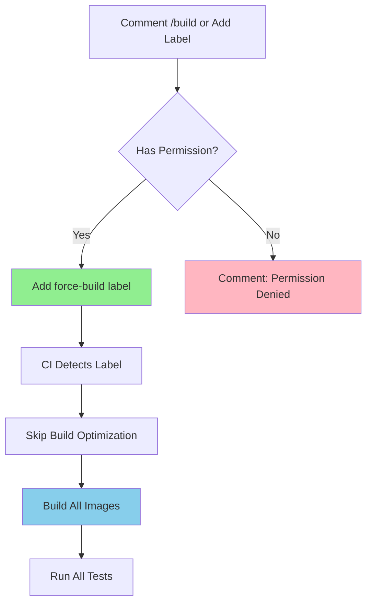

# 🤖 CI/CD Workflows

This directory contains GitHub Actions workflows for automated testing, building, and deployment.

## 📋 Workflows

### 1. `ci.yml` - Main CI/CD Pipeline

**Triggers:**
- Push to `master` branch
- Pull requests to any branch

**Stages:**
1. **Auto-Discover MCPs** - Automatically detects all MCP modules
2. **Compute Image Tags** - Generates Docker image tags (SHA, branch-hash, latest)
3. **Detect Changed Files** - Determines which files changed
4. **Build Base Image** - Builds the Python base image (if needed)
5. **Code Quality Checks** - Runs black, ruff, mypy (parallel per MCP)
6. **Security Scan** - Runs bandit, safety, pip-audit
7. **Build MCP Images** - Builds production + test images for all MCPs
8. **Test MCPs** - Runs pytest for all MCPs (parallel)
9. **Required Checks Summary** - Aggregates all results

**Smart Optimizations:**
- ✅ Skips builds if base files haven't changed (PRs only)
- ✅ Skips tests if no relevant files changed
- ✅ Caches pip dependencies for faster runs
- ✅ Builds multi-platform images (amd64 + arm64) on master
- ✅ Auto-scales with new MCPs (no manual updates needed!)

### 2. `build-trigger.yml` - Manual Build Override

**Triggers:**
- Comment `/build` on PR
- Add `force-build` label to PR

**Use Cases:**
- Force Docker builds when they would normally be skipped
- Test builds without changing base files
- Debug build issues

**How to Use:**

#### Option 1: Slash Command (Recommended)
Comment on your PR:
```
/build
```

The bot will:
1. ✅ Check if you have write access
2. 🚀 Add `force-build` label automatically
3. 🔔 Comment with confirmation
4. ▶️ Trigger full build pipeline

#### Option 2: Manual Label
1. Go to your PR
2. Click "Labels" on the right sidebar
3. Add `force-build` label
4. CI will automatically trigger builds

**Permissions:**
- Only users with `write` or `admin` access can trigger force builds
- Others will see "permission denied" message

### 3. `pr-cleanup.yml` - Docker Image Cleanup

**Triggers:**
- Pull request closed (merged or not)

**Actions:**
- Deletes PR-specific Docker images from Docker Hub
- Cleans up `br-<hash>` tagged images
- Frees up Docker Hub storage

## 🎯 Branch Protection Setup

### Required Status Checks

Add this single check to your branch protection rules:

```
✅ All Required Checks Passed
```

This one check covers:
- 🔍 Code Quality (black + ruff + mypy)
- 🛡️ Security Scan (bandit + safety + pip-audit)
- 🐳 Docker Builds (all MCPs)
- 🧪 Tests (all MCPs)
- 🗄️ Database Tests

**Setup Instructions:**
1. Go to: **Settings → Branches → Add rule**
2. Branch name pattern: `master`
3. Enable: ☑️ **Require status checks to pass before merging**
4. Search and select: `✅ All Required Checks Passed`
5. Enable: ☑️ **Require branches to be up to date before merging**
6. Save changes

## 🚀 Force Build Feature

### When to Use Force Builds?

**Scenarios:**
- 🔧 Testing Docker build changes without modifying base files
- 🐛 Debugging build issues
- 📦 Ensuring all images are rebuilt with latest dependencies
- 🔄 Rebuilding after Docker Hub cleanup
- 🧪 Testing multi-platform builds on PRs

### How It Works



### Example Workflow

```bash
# On your PR
$ gh pr comment 123 --body "/build"

# Bot responds with 🚀 reaction

# Bot adds force-build label

# Bot comments:
# 🚀 Force Build Triggered!
# Docker builds will run regardless of file changes...

# CI starts building:
# ✅ Build base image
# ✅ Build all MCP production images
# ✅ Build all MCP test images
# ✅ Run all tests

# After merge, remove label or it stays for reference
```

## 📊 CI Summary Features

Each CI run shows a beautiful summary with:

**Success Case:**
```
🎯 CI/CD Pipeline Summary

| Check          | Status    | Details                  |
|----------------|-----------|--------------------------|
| 🔍 Code Quality | ✅ Passed | black + ruff + mypy     |
| 🛡️ Security    | ✅ Passed | bandit + safety + audit |
| 🐳 Builds      | ✅ Passed | All MCP images built    |
| 🧪 Tests       | ✅ Passed | calculator, weather...  |
| 🗄️ DB Tests    | ✅ Passed | All tests passed        |

## ✅ All Checks Passed!
🎉 Your PR is ready to merge!

### 📊 Pipeline Stats
- Branch: feature/awesome-feature
- Commit: abc1234
- Triggered by: @username
```

**With Force Build:**
```
🎯 CI/CD Pipeline Summary

> 🚀 Force Build Active
> Docker builds are running regardless of file changes.
> Remove the force-build label to revert to automatic detection.

| Check          | Status    | Details                  |
|----------------|-----------|--------------------------|
...
```

## 🔐 Secrets Required

Configure these in **Settings → Secrets and variables → Actions**:

| Secret | Description | Usage |
|--------|-------------|-------|
| `DOCKERHUB_USERNAME` | Docker Hub username | Push images to Docker Hub |
| `DOCKERHUB_TOKEN` | Docker Hub access token | Authenticate Docker Hub |

**Docker Hub Token Setup:**
1. Go to https://hub.docker.com/settings/security
2. Click "New Access Token"
3. Name: `github-actions-mcptools`
4. Permissions: `Read, Write, Delete`
5. Copy token and add to GitHub secrets

## 🏗️ Adding New MCPs

**Zero configuration needed!** 🎉

The CI automatically:
1. Discovers new MCP folders
2. Adds them to quality checks
3. Builds their images
4. Runs their tests
5. Includes them in summary

**Example:**
```bash
# Create new MCP
mkdir email/
touch email/main.py
touch email/config/__init__.py

# Commit and push
git add email/
git commit -m "feat: add email MCP"
git push

# CI automatically:
# ✅ Runs quality checks for email
# ✅ Builds email production image
# ✅ Builds email test image
# ✅ Runs email tests
# ✅ Includes email in summary

# No workflow updates needed!
```

## 🐛 Troubleshooting

### Builds Not Triggering?

**Check:**
1. Are base files changed? (Dockerfile, requirements.txt, shared/)
2. Is this a PR to master?
3. Try force build: `/build` command

### Permission Denied for /build?

**You need:**
- Write or admin access to the repository
- Contact a maintainer to trigger builds

### Images Not on Docker Hub?

**Verify:**
1. Secrets are configured (`DOCKERHUB_USERNAME`, `DOCKERHUB_TOKEN`)
2. Check build logs for authentication errors
3. Verify Docker Hub repository exists: `sanjibdevnath/mcp-*`

### Tests Failing?

**Debug:**
1. Check test logs in GitHub Actions
2. Run locally: `make test-calc` (or weather, db)
3. Check if test data is properly initialized
4. Verify environment variables are set

## 📚 Additional Resources

- [GitHub Actions Docs](https://docs.github.com/en/actions)
- [Docker Buildx Docs](https://docs.docker.com/buildx/working-with-buildx/)
- [Matrix Strategy](https://docs.github.com/en/actions/using-jobs/using-a-matrix-for-your-jobs)
- [MCP Project README](../../README.md)

## 💡 Tips

**For Maintainers:**
- Use `/build` for quick manual builds
- Monitor Docker Hub storage (free tier: 200 repos)
- Clean up old images periodically
- Keep secrets updated

**For Contributors:**
- Don't worry about triggering builds
- CI handles everything automatically
- Focus on writing good code and tests
- Ask maintainers if you need force builds

---

**Questions?** Open an issue or ask in discussions! 🚀

